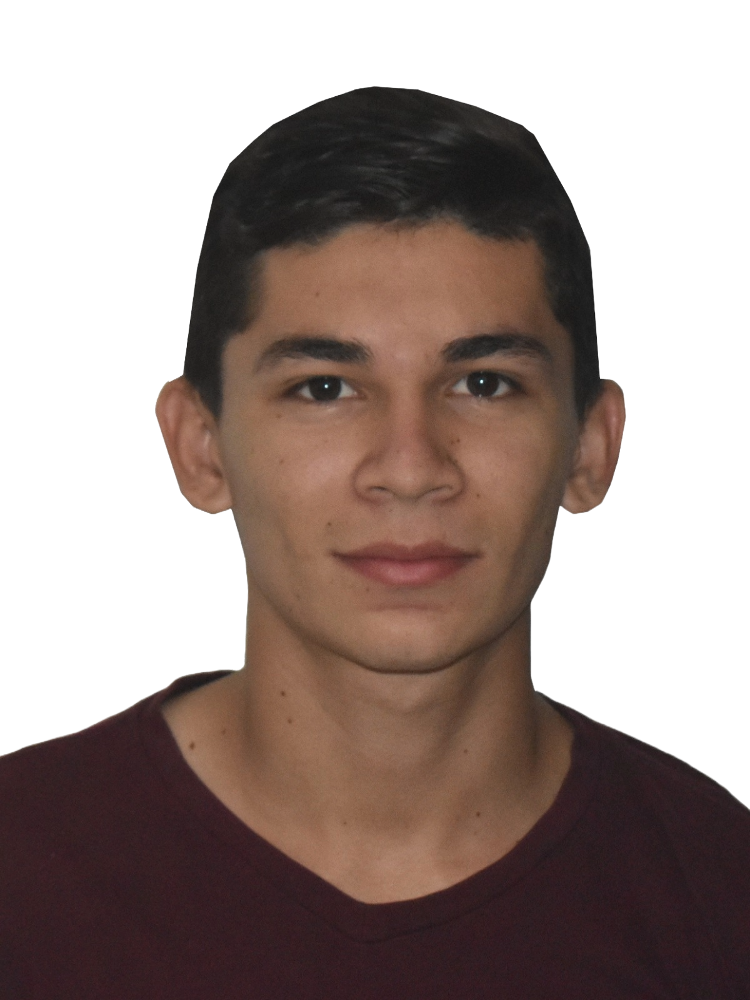

# CV - MAURI SANTIAGO FIGUEROA MACHADO
Desarrollador de software orientado a la web, con facultades en frontend y habilidades en Java
# Educación:
* Ingeniero de Sistemas - UFPSO
* Especialista en Auditoría de Sistemas - UFPSO
* Desarrollo de Aplicaciones Web 

</img>
